<div align="center">

# 📚 ECIEXPRESS — Microservicio de Recibos

### *"Sin filas, sin estrés, ECIEXPRESS"*

---

### 🛠️ Stack Tecnológico


### ☁️ Infraestructura & Calidad


### 🏗️ Arquitectura


</div>

---

## 📑 Tabla de Contenidos

1. [👤 Integrantes](#1--integrantes)
2. [🎯 Objetivo del Microservicio](#2--objetivo-del-microservicio)
3. [⚡ Funcionalidades Principales](#3--funcionalidades-principales)
4. [📋 Estrategia de Versionamiento y Branches](#4--manejo-de-estrategia-de-versionamiento-y-branches)
   - [4.1 Convenciones para crear ramas](#41-convenciones-para-crear-ramas)
   - [4.2 Convenciones para crear commits](#42-convenciones-para-crear-commits)
5. [⚙️ Tecnologías Utilizadas](#5--tecnologias-utilizadas)
6. [🧩 Funcionalidad](#6--funcionalidad)
7. [📊 Diagramas](#7--diagramas)
8. [⚠️ Manejo de Errores](#8--manejo-de-errores)
9. [🧪 Evidencia de Pruebas y Ejecución](#9--evidencia-de-las-pruebas-y-como-ejecutarlas)
10. [🗂️ Organización del Código](#10--codigo-de-la-implementacion-organizado-en-las-respectivas-carpetas)
11. [🚀 Ejecución del Proyecto](#11--ejecucion-del-proyecto)
12. [☁️ CI/CD y Despliegue en Azure](#12--evidencia-de-cicd-y-despliegue-en-azure)
13. [🤝 Contribuciones](#13--contribuciones)

---

## 1. 👤 Integrantes:

- Elizabeth Correa
- Daniel Palacios
- David Salamanca
- Tomas Ramirez
- Carolina Cepeda

## 2. 🎯 Objetivo del microservicio

El microservicio de Recibos tiene como objetivo generar, gestionar y mantener la trazabilidad de los comprobantes digitales asociados a los pedidos y pagos realizados dentro de la plataforma ECIExpress. Este servicio se encarga de crear recibos de manera automática una vez se confirma una transacción, registrar su estado a lo largo del ciclo de vida del pedido (PENDING, PAYED, DELIVERED, REFUNDED, etc.) y garantizar la integridad de la información financiera y operativa. Además, se integra con los microservicios de Pagos, Billetera y Validación QR para asegurar consistencia entre el pago, la entrega y el historial de transacciones, proporcionando respaldo, auditoría y confianza tanto para los usuarios como para los puntos de venta.

---

## 3. ⚡ Funcionalidades principales

<div align="center">

<table>
  <thead>
    <tr>
      <th>💡 Funcionalidad</th>
      <th>Descripción</th>
    </tr>
  </thead>
  <tbody>
    <tr>
      <td><strong>Generación de Recibos</strong></td>
      <td>Crea recibos digitales asociados a una orden y método de pago, almacenando montos, promociones aplicadas y datos de auditoría.</td>
    </tr>
    <tr>
      <td><strong>Gestión de Estados del Recibo</strong></td>
      <td>Administra el ciclo de vida del recibo (PENDING, PAYED, DELIVERED, REFUNDED), validando transiciones de estado según reglas de negocio.</td>
    </tr>
    <tr>
      <td><strong>Generación de Código QR</strong></td>
      <td>Genera un código QR único por recibo para validar el pago y habilitar la entrega segura del pedido en el punto de venta.</td>
    </tr>
    <tr>
      <td><strong>Consulta de Recibos</strong></td>
      <td>Permite consultar recibos por cliente o por orden, retornando información detallada del pago, método utilizado y timestamps.</td>
    </tr>
    <tr>
      <td><strong>Integración con Pagos y Validación QR</strong></td>
      <td>Se integra con el microservicio de Pagos para generar comprobantes y con Validación QR para confirmar pagos y entregas.</td>
    </tr>
  </tbody>
</table>

</div>


## 4. 📋 Manejo de Estrategia de versionamiento y branches

### Estrategia de Ramas (Git Flow)

### Ramas y propósito
- Manejaremos GitFlow, el modelo de ramificación para el control de versiones de Git

#### `main`
- **Propósito:** rama **estable** con la versión final (lista para demo/producción).
- **Reglas:**
    - Solo recibe merges desde `release/*` y `hotfix/*`.
    - Cada merge a `main` debe crear un **tag** SemVer (`vX.Y.Z`).
    - Rama **protegida**: PR obligatorio, 1–2 aprobaciones, checks de CI en verde.

#### `develop`
- **Propósito:** integración continua de trabajo; base de nuevas funcionalidades.
- **Reglas:**
    - Recibe merges desde `feature/*` y también desde `release/*` al finalizar un release.
    - Rama **protegida** similar a `main`.

#### `feature/*`
- **Propósito:** desarrollo de una funcionalidad, refactor o spike.
- **Base:** `develop`.
- **Cierre:** se fusiona a `develop` mediante **PR**


#### `release/*`
- **Propósito:** congelar cambios para estabilizar pruebas, textos y versiones previas al deploy.
- **Base:** `develop`.
- **Cierre:** merge a `main` (crear **tag** `vX.Y.Z`) **y** merge de vuelta a `develop`.
- **Ejemplo de nombre:**  
  `release/1.3.0`

#### `hotfix/*`
- **Propósito:** corregir un bug **crítico** detectado en `main`.
- **Base:** `main`.
- **Cierre:** merge a `main` (crear **tag** de **PATCH**) **y** merge a `develop` para mantener paridad.
- **Ejemplos de nombre:**  
  `hotfix/fix-blank-screen`, `hotfix/css-broken-header`


---

### 4.1 Convenciones para **crear ramas**

#### `feature/*`
**Formato:**
```
feature/[nombre-funcionalidad]-ECIExpress_[codigo-jira]
```

**Ejemplos:**
- `feature/readme_ECIExpress-34`

**Reglas de nomenclatura:**
- Usar **kebab-case** (palabras separadas por guiones)
- Máximo 50 caracteres en total
- Descripción clara y específica de la funcionalidad
- Código de Jira obligatorio para trazabilidad

#### `release/*`
**Formato:**
```
release/[version]
```
**Ejemplo:** `release/1.3.0`

#### `hotfix/*`
**Formato:**
```
hotfix/[descripcion-breve-del-fix]
```
**Ejemplos:**
- `hotfix/corregir-pantalla-blanca`
- `hotfix/arreglar-header-responsive`

---

### 4.2 Convenciones para **crear commits**

#### **Formato:**
```
[codigo-jira] [tipo]: [descripción específica de la acción]
```

#### **Tipos de commit:**
- `feat`: Nueva funcionalidad
- `fix`: Corrección de errores
- `docs`: Cambios en documentación

## 5. ⚙️ Tecnologías Utilizadas


| **Tecnología / Herramienta** | **Uso principal en el proyecto** |
|------------------------------|----------------------------------|
| **Java OpenJDK** | Lenguaje de programación base de los microservicios backend, orientado a objetos y multiplataforma. |
| **Spring Boot** | Framework principal para construir microservicios independientes, exponiendo APIs REST y gestionando configuración e inyección de dependencias. |
| **Spring Web** | Exposición de endpoints REST en cada microservicio (controladores HTTP) dentro de la arquitectura hexagonal. |
| **Spring Security** | Configuración de autenticación y autorización mediante roles, asegurando el acceso a los endpoints de los microservicios. |
| **Spring Data MongoDB** | Integración de cada microservicio con su base de datos NoSQL en MongoDB usando el patrón Repository y puertos/adaptadores. |
| **MongoDB Atlas** | Base de datos NoSQL en la nube, con colecciones independientes por dominio (pagos, billetera, recibos, promociones, usuarios, etc.). |
| **Apache Maven** | Gestión de dependencias, empaquetado de cada microservicio y automatización de builds en los pipelines CI/CD. |
| **Lombok** | Reducción de código repetitivo en los microservicios con anotaciones como `@Getter`, `@Setter`, `@Builder` y `@AllArgsConstructor`. |
| **JUnit 5** | Framework de pruebas unitarias para validar la lógica de dominio y casos de uso en cada microservicio. |
| **Mockito** | Simulación de dependencias (puertos, repositorios, clientes externos) en pruebas unitarias sin acceder a infraestructura real. |
| **JaCoCo** | Generación de reportes de cobertura de código de los microservicios para evaluar la efectividad de las pruebas. |
| **SonarQube** | Análisis estático del código y control de calidad, identificando vulnerabilidades, code smells y problemas de mantenibilidad. |
| **Swagger (OpenAPI 3)** | Generación automática de documentación y prueba interactiva de los endpoints REST de cada microservicio. |
| **Postman** | Entorno de pruebas de la API para validar manualmente las peticiones y respuestas JSON de los distintos microservicios (`POST`, `GET`, `PATCH`, `DELETE`). |
| **Docker** | Contenerización de cada microservicio para garantizar despliegues aislados y consistentes entre entornos. |
| **Azure App Service** | Entorno de ejecución en la nube donde se despliegan los contenedores Docker de los microservicios. |
| **Azure Container Registry (ACR)** | Almacenamiento y versionado de las imágenes Docker generadas en los pipelines de CI/CD. |
| **GitHub Actions** | Pipelines de integración y despliegue continuo (CI/CD) para compilar, probar, analizar y desplegar cada microservicio. |
| **AWS API Gateway** | Punto de entrada único al backend que enruta las solicitudes del cliente al microservicio correspondiente (Pagos, Wallet, Recibos, QR, etc.). |
| **AWS Lambda (Node.js)** | Funciones ligeras que actúan como lógica intermedia cuando se requiere preprocesar o adaptar solicitudes antes de enviarlas a los microservicios. |
| **SSL / HTTPS** | Cifrado de la comunicación entre cliente, API Gateway y microservicios para garantizar la seguridad de la información. |


> 🧠 **Stack tecnológico seleccionado** para asegurar **escalabilidad**, **modularidad**, **seguridad**, **trazabilidad** y **mantenibilidad**, aplicando buenas prácticas de ingeniería de software.

## 6. 🧩 Funcionalidades

---

### 🔑 Funcionalidades principales

### 1️⃣ Crear Recibo

Permite generar un nuevo recibo de transacción, validando montos, fechas y generando un código QR único para su posterior verificación.

**Endpoint principal:**  
`POST /api/v1/receipts`

---

### 📦 Estructura de la Solicitud (Request)

<div align="center">

| 🏷️ Campo | 🗃️ Tipo | ⚠️ Restricciones | 📝 Descripción |
|---|---|:---:|---|
| orderId | String | Obligatorio, Único | Identificador único de la orden asociada. |
| clientId | String | Obligatorio | Identificador del cliente que realiza la compra. |
| storeId | String | Obligatorio | Identificador de la tienda donde se realiza la transacción. |
| originalAmount | Double | > 0 | Monto original antes de aplicar promociones. |
| finalAmount | Double | > 0, <= originalAmount | Monto final después de descuentos. |
| paymentMethod | Object | Obligatorio | Objeto con información del método de pago. |
| paymentMethod.type | String | "BANK", "CASH", "WALLET" | Discriminador para deserialización. |
| paymentMethod.bankPaymentType | Enum | Obligatorio si type=BANK | Tipo de pago bancario (DEBIT_CARD, CREDIT_CARD, etc). |
| paymentMethod.bankReceiptNumber | String | Obligatorio si type=BANK | Número de recibo bancario. |
| timeStamps | Object | Obligatorio | Objeto con marcas temporales del proceso. |
| appliedPromotions | List<String> | Opcional | Lista de códigos de promociones aplicadas. |

</div>

---

### 📦 Estructura de la Respuesta (Response)

<div align="center">

| 🏷️ Campo | 🗃️ Tipo | 📝 Descripción |
|---|---|---|
| receiptId | String | Identificador único del recibo generado. |
| orderId | String | ID de la orden asociada. |
| finalAmount | Double | Monto final pagado. |
| receiptStatus | Enum | Estado del recibo (PENDING, PAYED, etc). |
| qrCode | String | Código QR en formato hash SHA-256. |

</div>


---

### ✅ Happy Path (Ejemplo de Uso Exitoso)

1. El cliente envía una solicitud POST con los detalles de la orden y el pago.
2. El sistema valida los montos y la coherencia de las fechas según el método de pago.
3. Se genera un ID único y un código QR de validación.
4. Se persiste el recibo en la base de datos.
5. Se retorna `201 CREATED` con el recibo y el QR generado.

**Request (Solicitud):**
```json
POST /api/v1/receipts
{
  "orderId": "ORD-2025-001",
  "clientId": "CLI-123456",
  "storeId": "STORE-01",
  "originalAmount": 150000.00,
  "finalAmount": 135000.00,
  "paymentMethod": {
    "type": "BANK",
    "paymentMethodType": "BANK",
    "bankPaymentType": "CREDIT_CARD",
    "bankReceiptNumber": "REC-789",
    "bankName": "Banco Bogota"
  },
  "timeStamps": {
    "createdAt": "2025-01-28T10:30:00Z",
    "paymentProcessedAt": "2025-01-28T10:28:00Z",
    "receiptGeneratedDate": "2025-01-28T10:30:00Z"
  }
}
```

**Response (Respuesta):**
```json
{
  "receiptId": "REC-2025-00123",
  "orderId": "ORD-2025-001",
  "finalAmount": 135000.00,
  "receiptStatus": "PAYED",
  "qrCode": "a3f5b9c2e8d1..."
}
```

---

### 🖼️ Diagrama de Secuencia

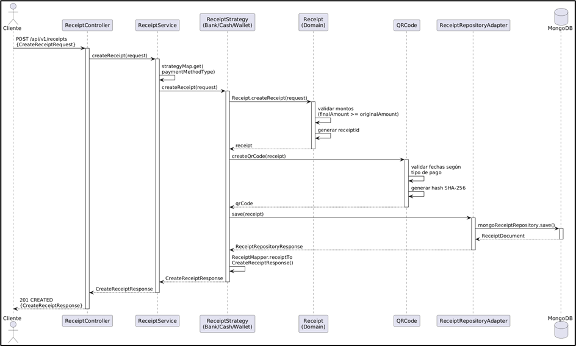

<details>
<summary><strong>🟢 Explicación del Flujo</strong></summary>

El proceso inicia cuando el cliente envía un POST al `ReceiptController`. El `ReceiptService` elige la estrategia correcta (BANK, CASH, WALLET) y crea el recibo validando montos y generando un ID único. Luego, se genera el código QR validando la coherencia de fechas (ej. pago bancario debe ser anterior a la generación). Finalmente, el recibo se persiste en MongoDB y se retorna la respuesta con el QR.

</details>

---

### 📊 Tipos de errores manejados

<div align="center">

| 🔢 **Código HTTP** | ⚠️ **Escenario** | 💬 **Mensaje de Error** |
|:------------------:|:----------------|:------------------------|
|  | Datos inválidos | `"Final amount cannot be less than original"` |
|  | Fechas incoherentes | `"Payment date must be before receipt generation"` |
|  | Recibo existente | `"Receipt already exists for order"` |
|  | Error interno | `"Database connection failed"` |

</div>

---

### 2️⃣ Consultar Recibos por Cliente

Permite obtener el historial completo de recibos asociados a un cliente específico.

**Endpoint principal:**  
`GET /api/v1/receipts/client/{clientId}`

---

### 📦 Estructura de la Solicitud (Request)

<div align="center">

| 🏷️ Campo | 🗃️ Tipo | ⚠️ Restricciones | 📝 Descripción |
|---|---|:---:|---|
| clientId | String | Obligatorio (Path) | Identificador del cliente a consultar. |

</div>

---

### 📦 Estructura de la Respuesta (Response)

<div align="center">

| 🏷️ Campo | 🗃️ Tipo | 📝 Descripción |
|---|---|---|
| receiptId | String | Identificador único del recibo. |
| paymentDetail | Object | Detalles de montos y promociones. |
| paymentMethod | Object | Información del método de pago utilizado. |
| receiptStatus | Enum | Estado actual del recibo. |
| timeStamps | Object | Fechas de creación y procesamiento. |

</div>


---

### ✅ Happy Path (Ejemplo de Uso Exitoso)

1. El cliente solicita los recibos enviando su `clientId`.
2. El sistema busca en la base de datos todos los documentos coincidentes.
3. Se transforman los documentos a DTOs de respuesta.
4. Se retorna la lista completa de recibos.

**Request (Solicitud):**
```json
GET /api/v1/receipts/client/CLI-123456
```

**Response (Respuesta):**
```json
[
  {
    "receiptId": "REC-001",
    "finalAmount": 135000.00,
    "receiptStatus": "PAYED"
  }
]
```

---

### 🖼️ Diagrama de Secuencia

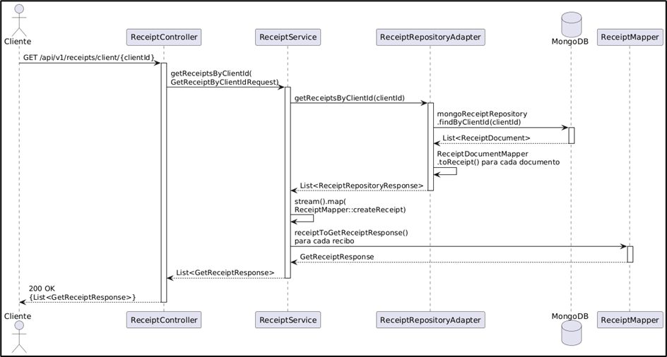

<details>
<summary><strong>🟢 Explicación del Flujo</strong></summary>

El `ReceiptController` recibe el `clientId` y lo pasa al `ReceiptService`. Este invoca al repositorio para buscar todos los recibos asociados en MongoDB. Los documentos recuperados se convierten a objetos de dominio y luego a DTOs de respuesta, entregando al cliente el historial completo con detalles de pago y estados.

</details>

---

### 📊 Tipos de errores manejados

<div align="center">

| 🔢 **Código HTTP** | ⚠️ **Escenario** | 💬 **Mensaje de Error** |
|:------------------:|:----------------|:------------------------|
|  | ID inválido | `"Client ID cannot be null or empty"` |
|  | No encontrado | `"No receipts found for client"` |
|  | Error interno | `"Database connection failed"` |

</div>

---

### 3️⃣ Consultar Recibo por Orden

Permite recuperar un recibo específico asociado a una orden de compra.

**Endpoint principal:**  
`GET /api/v1/receipts/order/{orderId}`

---

### 📦 Estructura de la Solicitud (Request)

<div align="center">

| 🏷️ Campo | 🗃️ Tipo | ⚠️ Restricciones | 📝 Descripción |
|---|---|:---:|---|
| orderId | String | Obligatorio (Path) | Identificador de la orden a consultar. |

</div>

---

### 📦 Estructura de la Respuesta (Response)

<div align="center">

| 🔢 Código HTTP | 📝 Descripción |
|:---:|---|
|  | **Consulta exitosa.** Retorna el recibo encontrado. |

</div>

*(Misma estructura de respuesta que Consultar por Cliente)*

---

### ✅ Happy Path (Ejemplo de Uso Exitoso)

1. El cliente envía el `orderId`.
2. El sistema busca el recibo único asociado a esa orden.
3. Si existe, se retorna la información completa del recibo.

**Request (Solicitud):**
```json
GET /api/v1/receipts/order/ORD-2025-001
```

**Response (Respuesta):**
```json
{
  "receiptId": "REC-2025-00123",
  "orderId": "ORD-2025-001",
  "receiptStatus": "PAYED"
}
```

---

### 🖼️ Diagrama de Secuencia

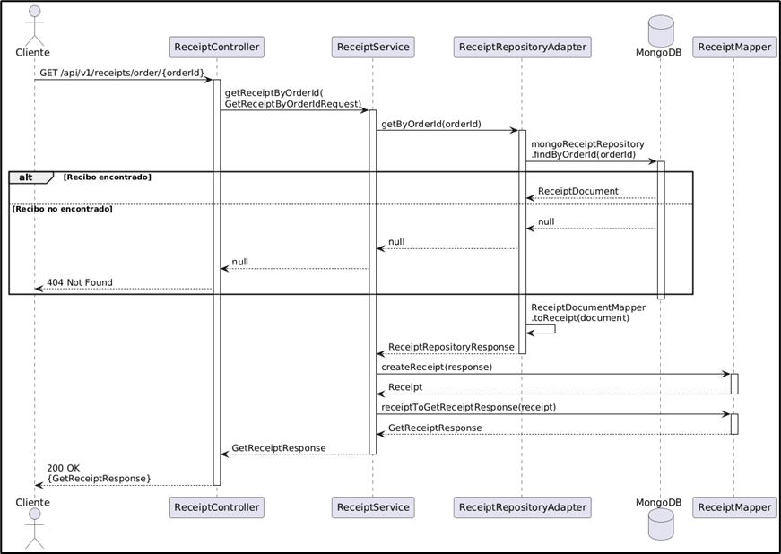

<details>
<summary><strong>🟢 Explicación del Flujo</strong></summary>

La consulta de un recibo por `orderId` comienza cuando el `ReceiptController` recibe un GET con ese identificador. El controlador crea un `GetReceiptByOrderIdRequest` y lo envía al `ReceiptService`.

El servicio llama a `ReceiptRepositoryAdapter.getByOrderId()`, que ejecuta una consulta en MongoDB usando `MongoReceiptRepository.findByOrderId()` para buscar el documento que corresponde a esa orden.

- Si no existe, MongoDB devuelve null, el adaptador pasa ese resultado hacia arriba y el controlador responde con **HTTP 404 Not Found**.
- Si existe, el adaptador convierte el `ReceiptDocument` a un objeto de dominio `Receipt` usando `ReceiptDocumentMapper.toReceipt()`.

Luego, el servicio transforma el recibo en un `GetReceiptResponse` utilizando `receiptToGetReceiptResponse()`, incluyendo toda la información relevante: detalles de pago, método de pago (con sus atributos según el tipo), estados del recibo y del pedido, y timestamps.

Finalmente, el controlador responde con **HTTP 200** y retorna al cliente el recibo completo asociado a esa orden.

</details>

---

### 📊 Tipos de errores manejados

<div align="center">

| 🔢 **Código HTTP** | ⚠️ **Escenario** | 💬 **Mensaje de Error** |
|:------------------:|:----------------|:------------------------|
|  | ID inválido | `"Order ID cannot be null or empty"` |
|  | No encontrado | `"Receipt not found for order"` |
|  | Error interno | `"Database connection failed"` |

</div>

---

### 4️⃣ Obtener Código QR por Orden

Permite recuperar el código QR de validación para un recibo existente.

**Endpoint principal:**  
`GET /api/v1/receipts/order/{orderId}/qr`

---

### 📦 Estructura de la Solicitud (Request)

<div align="center">

| 🏷️ Campo | 🗃️ Tipo | ⚠️ Restricciones | 📝 Descripción |
|---|---|:---:|---|
| orderId | String | Obligatorio (Path) | Identificador de la orden. |

</div>

---

### 📦 Estructura de la Respuesta (Response)

<div align="center">

| 🏷️ Campo | 🗃️ Tipo | 📝 Descripción |
|---|---|---|
| QRCode | String | Código QR en formato hash SHA-256. |

</div>


---

### ✅ Happy Path (Ejemplo de Uso Exitoso)

1. El cliente solicita el QR para una orden.
2. El sistema recupera el recibo y regenera el QR validando fechas.
3. Se retorna el código hash para validación física.

**Request (Solicitud):**
```json
GET /api/v1/receipts/order/ORD-2025-001/qr
```

**Response (Respuesta):**
```json
{
  "QRCode": "a3f5b9c2e8d1..."
}
```

---

### 🖼️ Diagrama de Secuencia

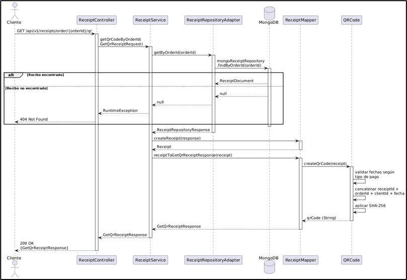

<details>
<summary><strong>🟢 Explicación del Flujo</strong></summary>

El servicio busca el recibo por `orderId`. Si existe, regenera el código QR aplicando las mismas validaciones de fecha que en la creación (ej. fecha de pago vs generación) y aplicando SHA-256 a la concatenación de IDs. Si todo es correcto, retorna el hash.

</details>

---

### 📊 Tipos de errores manejados

<div align="center">

| 🔢 **Código HTTP** | ⚠️ **Escenario** | 💬 **Mensaje de Error** |
|:------------------:|:----------------|:------------------------|
|  | No encontrado | `"Receipt not found"` |
|  | Error validación | `"Failed to generate QR code"` |

</div>

---

### 5️⃣ Actualizar Recibo a Pagado

Actualiza el estado de un recibo a PAGADO tras la confirmación de la transacción.

**Endpoint principal:**  
`PATCH /api/v1/receipts/{orderId}/pay`

---

### 📦 Estructura de la Solicitud (Request)

<div align="center">

| 🏷️ Campo | 🗃️ Tipo | ⚠️ Restricciones | 📝 Descripción |
|---|---|:---:|---|
| orderId | String | Obligatorio (Path) | Identificador de la orden a actualizar. |

</div>

---

### 📦 Estructura de la Respuesta (Response)

<div align="center">

| 🔢 Código HTTP | 📝 Descripción |
|:---:|---|
|  | **Actualización exitosa.** |

</div>

---

### ✅ Happy Path (Ejemplo de Uso Exitoso)

1. El cliente solicita marcar el recibo como pagado.
2. El sistema verifica que el estado actual sea `PENDING`.
3. Se actualiza a `PAYED` y se persiste.
4. Se retorna confirmación exitosa.

**Request (Solicitud):**
```json
PATCH /api/v1/receipts/ORD-2025-001/pay
```

**Response (Respuesta):**
```json
200 OK
```

---

### 🖼️ Diagrama de Secuencia

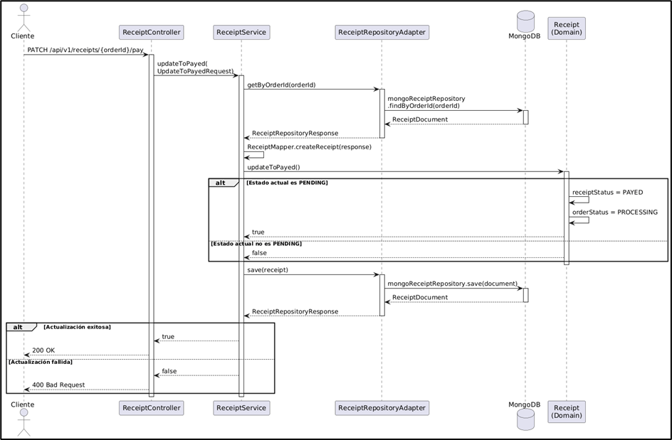

<details>
<summary><strong>🟢 Explicación del Flujo</strong></summary>

El servicio recupera el recibo y verifica si su estado es `PENDING`. Si es así, lo cambia a `PAYED` y actualiza el estado de la orden a `PROCESSING`. Si no está en estado `PENDING`, la operación falla. El resultado se persiste en MongoDB.

</details>

---

### 📊 Tipos de errores manejados

<div align="center">

| 🔢 **Código HTTP** | ⚠️ **Escenario** | 💬 **Mensaje de Error** |
|:------------------:|:----------------|:------------------------|
|  | Estado inválido | `"Current status is not PENDING"` |
|  | No encontrado | `"Receipt not found"` |
|  | Error interno | `"Persistence error"` |

</div>

---

### 6️⃣ Actualizar Recibo a Entregado

Marca el recibo como ENTREGADO una vez que el producto ha llegado al cliente.

**Endpoint principal:**  
`PATCH /api/v1/receipts/{orderId}/deliver`

---

### 📦 Estructura de la Solicitud (Request)

<div align="center">

| 🏷️ Campo | 🗃️ Tipo | ⚠️ Restricciones | 📝 Descripción |
|---|---|:---:|---|
| orderId | String | Obligatorio (Path) | Identificador de la orden a actualizar. |

</div>

---

### 📦 Estructura de la Respuesta (Response)

<div align="center">

| 🔢 Código HTTP | 📝 Descripción |
|:---:|---|
|  | **Actualización exitosa.** |

</div>

---

### ✅ Happy Path (Ejemplo de Uso Exitoso)

1. El cliente solicita marcar el recibo como entregado.
2. El sistema verifica que el estado actual sea `PAYED`.
3. Se actualiza a `DELIVERED` y se persiste.
4. Se retorna confirmación exitosa.

**Request (Solicitud):**
```json
PATCH /api/v1/receipts/ORD-2025-001/deliver
```

**Response (Respuesta):**
```json
200 OK
```

---

### 🖼️ Diagrama de Secuencia

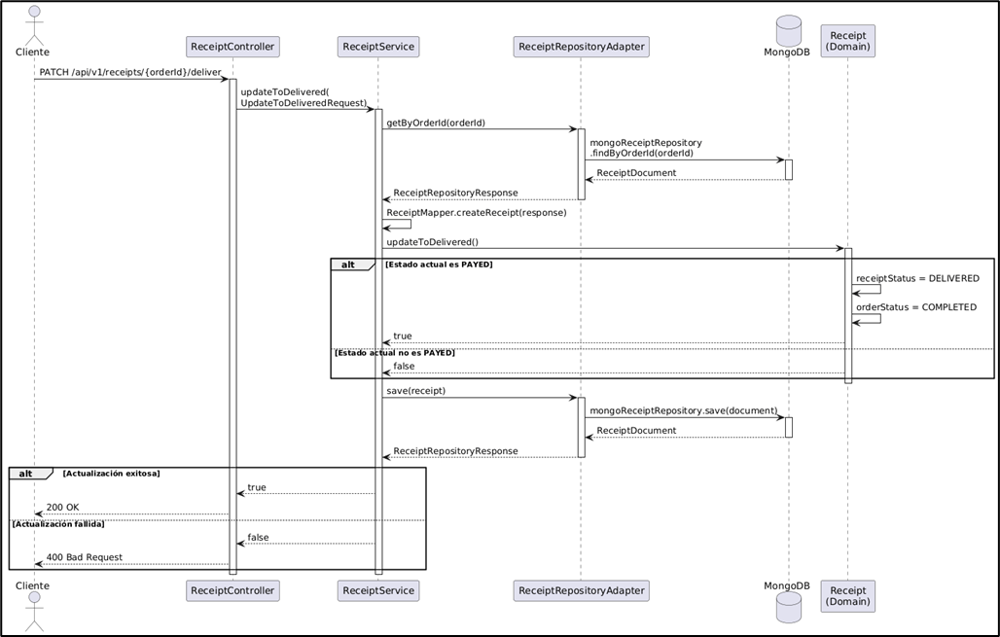

<details>
<summary><strong>🟢 Explicación del Flujo</strong></summary>

El servicio recupera el recibo y valida que su estado sea `PAYED`. Si es correcto, actualiza el estado a `DELIVERED` y el de la orden a `COMPLETED`. Si el recibo no estaba pagado, la operación es rechazada.

</details>

---

### 📊 Tipos de errores manejados

<div align="center">

| 🔢 **Código HTTP** | ⚠️ **Escenario** | 💬 **Mensaje de Error** |
|:------------------:|:----------------|:------------------------|
|  | Estado inválido | `"Current status is not PAYED"` |
|  | No encontrado | `"Receipt not found"` |
|  | Error interno | `"Persistence error"` |

</div>

---

## 7. 📊 Diagramas

Esta sección muestra los diagramas clave del microservicio de recibos, ilustrando su arquitectura, componentes principales y despliegue.

---

### 🏗️ Diagrama de Componentes — Vista General
<div align="center">
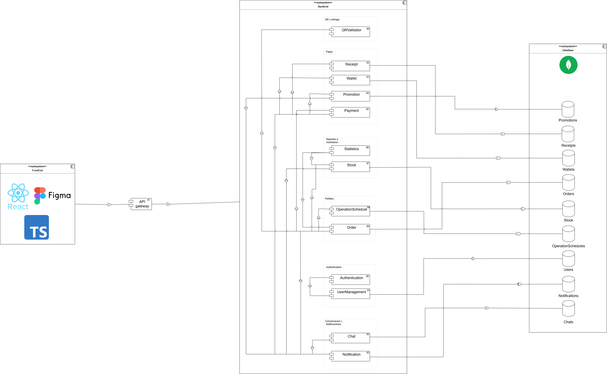
</div>


---

### 🔍 Diagrama de Componentes — Vista Específica

<div align="center">
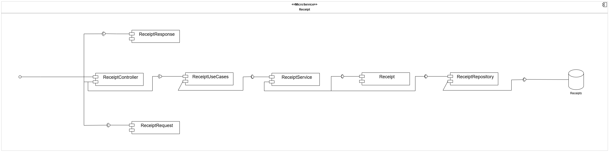
</div>

**Arquitectura Hexagonal:**  
El microservicio de Receipts separa controladores, casos de uso, lógica de negocio y adaptadores externos para mantener modularidad y escalabilidad.

**Flujo principal:**

- **ReceiptController**
  - Recibe solicitudes HTTP (Crear recibo, consultar por cliente/orden, generar QR, actualizar estados).
  - Delega la ejecución al puerto `ReceiptUseCases`, implementado por `ReceiptService`.

**Lógica de Negocio (Dominio):**

- **ReceiptService**
  - Orquesta la lógica mediante el patrón **Strategy**, seleccionando dinámicamente la estrategia según el método de pago (`BankReceiptStrategy`, `CashReceiptStrategy`, `WalletReceiptStrategy`).
  - Utiliza `ReceiptMapper` para convertir entidades en DTOs de salida.

- **Estrategias de Recibo**
  - **BankReceiptStrategy:** Valida procesamiento previo y marca estado `PAYED`.
  - **CashReceiptStrategy:** Verifica fechas y mantiene estado `PENDING`.
  - **WalletReceiptStrategy:** Aplica validaciones de billetera digital.

- **Receipt (Entidad)**
  - Encapsula la lógica de negocio y utiliza `QRCode` para generar códigos únicos con validaciones de `DateUtils`.

**Integración y Adaptadores:**

- **Persistencia:**
  - `ReceiptService` invoca el puerto `ReceiptRepositoryProvider`.
  - `ReceiptRepositoryAdapter` traduce entre dominio (`Receipt`) y persistencia (`ReceiptDocument`) usando `ReceiptDocumentMapper`.
  - Persiste en MongoDB con queries personalizadas para `clientId` y `orderId`.

- **Manejo de Errores:**
  - `Receipt` y `QRCode` lanzan excepciones de dominio (fechas inconsistentes).
  - Las estrategias propagan `RuntimeException`.
  - `OpenApiConfig` genera documentación Swagger.

> El microservicio Receipts gestiona la generación, almacenamiento y consulta de recibos de transacciones, integrándose con múltiples servicios del ecosistema.


### 🔌 Servicios Externos Integrados

El microservicio se integra con otros sistemas mediante REST/HTTP a través del API Gateway.

<div align="center">

| 🌍 **Microservicio** | ⚙️ **Operación** | 📋 **Propósito** |
|:---------------|:----------------|:-----------------------|
| **Payment** | Crear Recibo | Generar comprobante al completar transacción |
| **QR Service** | Obtener código QR | Validar recibo físicamente en tienda |
| **Orders** | Consultar recibo | Verificar estado de pago de una orden |
| **Orders** | Actualizar a entregado | Marcar recibo como completado al entregar |
| **Wallets** | Consultar por cliente | Obtener historial de recibos de transacciones digitales |

</div>

**Dominio y Mapeo:**

- La entidad `Receipt` encapsula la lógica central.
- `ReceiptMapper` transforma los datos entre capas, asegurando respuestas completas y correctas.

> El diagrama ilustra cómo el dominio de recibos se mantiene aislado de la infraestructura, permitiendo cambiar la base de datos o los adaptadores externos sin afectar las reglas de negocio.


---
### 📊 Diagrama de base de datos

<div align="center">
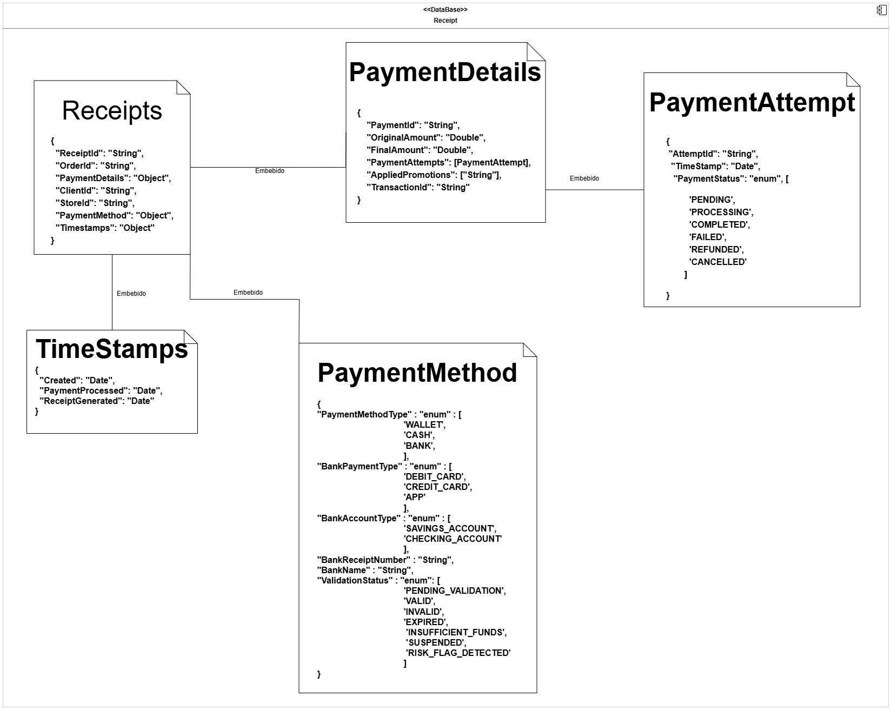
</div>

El microservicio de Receipts utiliza **MongoDB** como motor de base de datos NoSQL. La base de datos aloja la colección `Receipts`, responsable de persistir la información de los recibos generados.

#### 📋 Colección: `Receipts`

La colección `Receipts` almacena documentos con una estructura raíz y objetos embebidos:

<div align="center">

| 🏷️ Campo | 🗃️ Tipo | 📝 Descripción | ⚠️ Restricciones |
|:---|:---|:---|:---|
| **_id** | `ObjectId` | Identificador único generado automáticamente por MongoDB | Primary Key |
| **receiptId** | `String` | Identificador único del recibo (IdGenerator) | Único, Obligatorio |
| **orderId** | `String` | Identificador de la orden asociada | Indexado |
| **clientId** | `String` | Identificador del cliente | Indexado |
| **storeId** | `String` | Identificador de la tienda | Obligatorio |
| **paymentDetail** | `Object` | Detalles del pago (montos, promociones) | Embebido |
| **paymentMethod** | `Object` | Método de pago (Polimórfico: CASH, WALLET, BANK) | Embebido |
| **receiptStatus** | `Enum` | Estado del recibo (PENDING, PAYED, DELIVERED) | Obligatorio |
| **timeStamps** | `Object` | Fechas de auditoría y proceso | Embebido |

</div>

**Características de diseño:**

- **Persistencia:** Se gestiona a través de la clase `ReceiptDocument`, mapeada a la colección `Receipts`.
- **Optimización:** `MongoReceiptRepository` utiliza queries personalizadas para consultas frecuentes por `clientId` y `orderId`.
- **Estructura Embebida:**
  - **PaymentDetails:** Encapsula `originalAmount`, `finalAmount`, `bankReceiptNumber` y `appliedPromotions`.
  - **PaymentMethod:** Utiliza discriminación por tipo (`@JsonTypeInfo`) para `WALLET`, `CASH`, `BANK`.
  - **TimeStamps:** Almacena `createdAt`, `paymentProcessedAt` y `receiptGeneratedDate` para trazabilidad.
- **Adaptador:** `ReceiptRepositoryAdapter` utiliza `ReceiptDocumentMapper` para transformar documentos en entidades de dominio.


---

### 📦 Diagrama de Clases del Dominio

<div align="center">
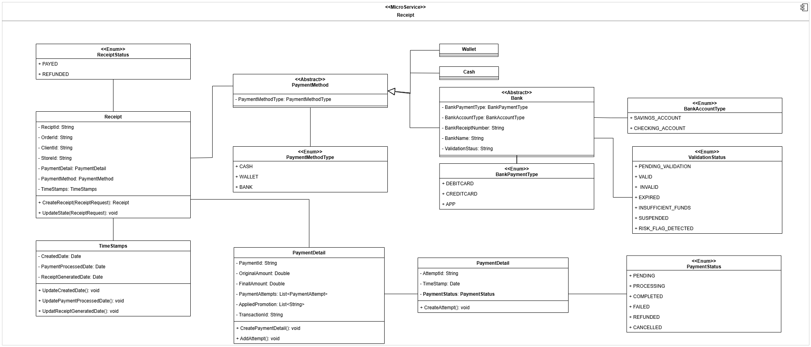
</div>

**Resumen del diseño de dominio:**

La arquitectura de dominio se centra en la entidad **Receipt**, que agrupa toda la información del recibo y gestiona su ciclo de vida.

- **Entidad de Dominio (DDD):** `Receipt` contiene identificadores (`receiptId`, `orderId`, `clientId`, `storeId`) y maneja estados (`ReceiptStatus`, `OrderStatus`).
- **Factory Method:** `createReceipt()` garantiza la creación correcta de la entidad. Métodos como `updateToPayed()` y `updateToDelivered()` gestionan las transiciones de estado según reglas de negocio.
- **Objetos de Valor y Componentes:**
  - **PaymentDetail:** Agrupa `paymentId`, montos (`original`, `final`) y promociones. Valida que el monto final no sea menor al original.
  - **TimeStamps:** Gestiona fechas críticas (creación, pago, generación) con formato ISO 8601.
- **Polimorfismo en PaymentMethod:**
  - Clase abstracta `PaymentMethod` con tres implementaciones:
    - **Bank:** Incluye atributos bancarios (tipo de cuenta, banco, validación).
    - **Cash** y **Wallet:** Implementaciones específicas.
  - Cada subclase utiliza su propio factory method.
- **Enumeraciones:** `PaymentMethodType` (CASH, WALLET, BANK) facilita la discriminación de tipos y serialización.

> Este diseño asegura la integridad del recibo y permite extender los métodos de pago sin afectar la estructura central.


---

### 📦 DTOs Principales

<div align="center">
<div style="background:#111; color:#fff; border-radius:12px; padding:24px 12px; box-shadow:0 2px 12px #0002;">

<table style="border:2px solid #4A90E2; border-radius:8px;">
  <caption style="font-size:1.15em; font-weight:bold; color:#4A90E2; padding:8px;">📨 <u>Request DTOs</u></caption>
  <thead style="background:#222; color:#fff;">
    <tr>
      <th style="padding:8px;">DTO</th>
      <th style="padding:8px;">Atributos Principales</th>
      <th style="padding:8px;">Descripción</th>
    </tr>
  </thead>
  <tbody>
    <tr>
      <td><b>CreateReceiptRequest</b></td>
      <td>orderId, clientId, storeId, originalAmount, finalAmount, paymentMethod, timeStamps, appliedPromotions</td>
      <td>Solicitud para generar un nuevo recibo tras completar una transacción.</td>
    </tr>
    <tr>
      <td><b>GetReceiptByClientIdRequest</b></td>
      <td>clientId</td>
      <td>Consulta para obtener todos los recibos asociados a un cliente específico.</td>
    </tr>
    <tr>
      <td><b>GetReceiptByOrderIdRequest</b></td>
      <td>orderId</td>
      <td>Consulta para recuperar el recibo de una orden particular.</td>
    </tr>
    <tr>
      <td><b>GetQrReceiptRequest</b></td>
      <td>orderId</td>
      <td>Solicitud para obtener el código QR de validación de un recibo.</td>
    </tr>
    <tr>
      <td><b>UpdateToPayedRequest</b></td>
      <td>orderId</td>
      <td>Actualización de estado cuando se confirma el pago de una orden.</td>
    </tr>
    <tr>
      <td><b>UpdateToDeliveredRequest</b></td>
      <td>orderId</td>
      <td>Actualización de estado cuando se entrega el producto al cliente.</td>
    </tr>
  </tbody>
</table>

<br>

<table style="border:2px solid #43A047; border-radius:8px;">
  <caption style="font-size:1.15em; font-weight:bold; color:#43A047; padding:8px;">📤 <u>Response DTOs</u></caption>
  <thead style="background:#222; color:#fff;">
    <tr>
      <th style="padding:8px;">DTO</th>
      <th style="padding:8px;">Atributos Principales</th>
      <th style="padding:8px;">Descripción</th>
    </tr>
  </thead>
  <tbody>
    <tr>
      <td><b>CreateReceiptResponse</b></td>
      <td>receiptId, orderId, clientId, storeId, finalAmount, receiptStatus, qrCode</td>
      <td>Confirmación de creación de recibo con identificador único y código QR.</td>
    </tr>
    <tr>
      <td><b>GetReceiptResponse</b></td>
      <td>receiptId, orderId, clientId, storeId, paymentDetail, paymentMethod, receiptStatus, orderStatus, timeStamps</td>
      <td>Respuesta completa con toda la información del recibo.</td>
    </tr>
    <tr>
      <td><b>GetQrReceiptResponse</b></td>
      <td>qrCode</td>
      <td>Código QR generado para validación en tienda.</td>
    </tr>
    <tr>
      <td><b>ApiError</b></td>
      <td>code, message, timestamp, path</td>
      <td>Estructura estandarizada para el retorno de excepciones.</td>
    </tr>
  </tbody>
</table>

<br>

<table style="border:2px solid #F0AD4E; border-radius:8px;">
  <caption style="font-size:1.15em; font-weight:bold; color:#F0AD4E; padding:8px;">⚙️ <u>DTOs Internos & Enums</u></caption>
  <thead style="background:#222; color:#fff;">
    <tr>
      <th style="padding:8px;">Objeto</th>
      <th style="padding:8px;">Detalle</th>
      <th style="padding:8px;">Descripción</th>
    </tr>
  </thead>
  <tbody>
    <tr>
      <td><b>ReceiptDocument</b></td>
      <td>receiptId, orderId, clientId, storeId, paymentDetail, paymentMethod, receiptStatus, orderStatus, timeStamps</td>
      <td>Documento MongoDB mapeado a la colección Receipts.</td>
    </tr>
    <tr>
      <td><b>ReceiptRepositoryResponse</b></td>
      <td>receiptDocument</td>
      <td>Wrapper retornado por el adaptador de persistencia.</td>
    </tr>
    <tr>
      <td><b>ReceiptStatus</b></td>
      <td>PENDING, PAYED, DELIVERED, REFUNDED</td>
      <td>Estado del recibo en el ciclo de vida.</td>
    </tr>
    <tr>
      <td><b>PaymentMethodType</b></td>
      <td>CASH, WALLET, BANK</td>
      <td>Discriminador de tipo para polimorfismo.</td>
    </tr>
  </tbody>
</table>

</div>
</div>

---

### 🗄️ Diagrama de Despliegue

<div align="center">

</div>

---

#### 🚀 Despliegue e Infraestructura

El microservicio de **Receipts** se ejecuta como un contenedor Docker en **Azure App Service**, respaldado por una arquitectura robusta de CI/CD y servicios en la nube.

- **Ejecución:** Contenedor Docker en Azure App Service (Imagen desde ACR).
- **Frontend:** React + TypeScript consume la API vía **API Gateway** (Enrutamiento, CORS, Auth).
- **Persistencia:** **MongoDB Atlas** (Colección `Receipts`) con alta disponibilidad y backups.
- **CI/CD (GitHub Actions):**
  - `ci.yml`: Pruebas (JUnit 5), Cobertura (JaCoCo), Calidad (SonarQube).
  - `cd_dev.yml`: Despliegue automático a Desarrollo (Rama `develop`).
  - `cd_prod.yml`: Despliegue automático a Producción (Rama `main`).
- **Construcción:** Dockerfile Multi-stage (Maven Build -> JRE Alpine Runtime).
- **Configuración:** Variables de entorno en Azure (`SPRING_PROFILES_ACTIVE`, `MONGODB_URI`).

<div align="center">

| 🌐 **Componente**         | 📝 **Descripción**                                 |
|--------------------------|---------------------------------------------------|
| Azure App Service        | Hosting del contenedor Docker del microservicio   |
| Azure Container Registry | Almacenamiento y versionado de imágenes Docker    |
| GitHub Actions           | Automatización de CI/CD y calidad de código       |
| API Gateway              | Punto de entrada único para el frontend           |
| MongoDB Atlas            | Base de datos NoSQL, alta disponibilidad y backups|

</div>


---

## 8. ⚠️ Manejo de Errores

El backend de **ECIExpress** implementa un **mecanismo centralizado de manejo de errores** que garantiza uniformidad, claridad y seguridad en todas las respuestas enviadas al cliente cuando ocurre un fallo.

Este sistema permite mantener una comunicación clara entre el backend y el frontend, asegurando que los mensajes de error sean legibles, útiles y coherentes, sin exponer información sensible del servidor.

---

### 🧠 Estrategia general de manejo de errores

El sistema utiliza una **clase global** que intercepta todas las excepciones lanzadas desde los controladores REST.  
A través de la anotación `@ControllerAdvice`, se centraliza el manejo de errores, evitando el uso repetitivo de bloques `try-catch` en cada endpoint.

Cada error se transforma en una respuesta **JSON estandarizada**, que mantiene un formato uniforme para todos los tipos de fallos.


---

### ⚙️ Global Exception Handler

El **Global Exception Handler** es una clase con la anotación `@ControllerAdvice` que captura y maneja todas las excepciones del sistema.  
Utiliza métodos con `@ExceptionHandler` para procesar errores específicos y devolver una respuesta personalizada acorde al tipo de excepción.

**✨ Características principales:**

- ✅ **Centraliza** la captura de excepciones desde todos los controladores
- ✅ **Retorna mensajes JSON consistentes** con el mismo formato estructurado
- ✅ **Asigna códigos HTTP** según la naturaleza del error (400, 404, 409, 500, etc.)
- ✅ **Define mensajes descriptivos** que ayudan tanto al desarrollador como al usuario
- ✅ **Mantiene la aplicación limpia**, eliminando bloques try-catch redundantes
- ✅ **Mejora la trazabilidad** y facilita la depuración en los entornos de prueba y producción


---

### 🧩 Validaciones en DTOs

Además del manejo global de errores, el sistema utiliza **validaciones automáticas** sobre los DTOs (Data Transfer Objects) para garantizar que los datos que llegan al servidor cumplan con las reglas de negocio antes de ejecutar cualquier lógica.

Estas validaciones se implementan mediante las anotaciones de **Javax Validation** y **Hibernate Validator**, como `@NotBlank`, `@NotNull`, `@Email`, `@Min`, `@Max`, entre otras.


Si alguno de los campos no cumple las validaciones, se lanza automáticamente una excepción del tipo `MethodArgumentNotValidException`.  
Esta es capturada por el **Global Exception Handler**, que devuelve una respuesta JSON estandarizada con el detalle del campo inválido.


> 💡 Gracias a este mecanismo, se asegura que las peticiones erróneas sean detectadas desde el inicio, reduciendo fallos en capas más profundas como servicios o repositorios.

---

### ✅ Beneficios del manejo centralizado

<div align="center">

| 🎯 **Beneficio** | 📋 **Descripción** |
|:-----------------|:-------------------|
| **🎯 Uniformidad** | Todas las respuestas de error tienen el mismo formato JSON estandarizado |
| **🔧 Mantenibilidad** | Agregar nuevas excepciones no requiere modificar cada controlador |
| **🔒 Seguridad** | Oculta los detalles internos del servidor y evita exponer trazas sensibles |
| **📍 Trazabilidad** | Cada error incluye información contextual (ruta, timestamp y descripción) |
| **🤝 Integración fluida** | Facilita la comunicación con frontend y herramientas como Postman/Swagger |

</div>

---

> Gracias a este enfoque, el backend de ECIExpress logra un manejo de errores **robusto**, **escalable** y **seguro**, garantizando una experiencia de usuario más confiable y profesional.

---


---

## 9. 🧪 Evidencia de las pruebas y cómo ejecutarlas

El backend de **ECIExpress** implementa una **estrategia integral de pruebas** que garantiza la calidad, funcionalidad y confiabilidad del código mediante pruebas unitarias y de integración.

---

### 🎯 Tipos de pruebas implementadas

<div align="center">

| 🧪 **Tipo de Prueba** | 📋 **Descripción** | 🛠️ **Herramientas** |
|:---------------------|:-------------------|:--------------------|
| **Pruebas Unitarias** | Validan el funcionamiento aislado de componentes (servicios, estrategias, validadores) |   |
| **Cobertura de Código** | Mide el porcentaje de código cubierto por las pruebas |  |
| **Pruebas de Integración** | Verifican la interacción entre capas y servicios externos |  |

</div>

---

### 🚀 Cómo ejecutar las pruebas

#### **1️⃣ Ejecutar todas las pruebas**

Desde la raíz del proyecto, ejecuta:

```bash
mvn clean test
```

Este comando:
- Limpia compilaciones anteriores (`clean`)
- Ejecuta todas las pruebas unitarias y de integración (`test`)
- Muestra el resultado en la consola

#### **2️⃣ Generar reporte de cobertura con JaCoCo**

```bash
mvn clean test jacoco:report
```

El reporte HTML se generará en:
```
target/site/jacoco/index.html
```

Abre este archivo en tu navegador para ver:
- Cobertura por paquete
- Cobertura por clase
- Líneas cubiertas vs. no cubiertas

#### **3️⃣ Ejecutar pruebas desde IntelliJ IDEA**

1. Click derecho sobre la carpeta `src/test/java`
2. Selecciona **"Run 'Tests in...'**
3. Ver resultados en el panel inferior

#### **4️⃣ Ejecutar una prueba específica**

```bash
mvn test -Dtest=ReceiptControllerTest
```

---

### 🧪 Ejemplo de prueba de integración

A continuación se muestra un ejemplo real de una prueba de integración para el controlador de recibos (`ReceiptController`), donde se valida la creación exitosa de un recibo simulando una petición HTTP.

```java
    @Test
    @DisplayName("Should create receipt and return 201")
    void createReceipt_ShouldReturnCreated() throws Exception {
        // Given
        CreateReceiptRequest request = new CreateReceiptRequest(
                "order123", "client123", "store456",
                100.0, 90.0, null, null, List.of("PROMO10")
        );

        CreateReceiptResponse response = new CreateReceiptResponse(
                "receipt123", "order123", "client123", "store456",
                90.0, ReceiptStatus.PENDING, "qr_code_123"
        );

        when(receiptUseCases.createReceipt(any(CreateReceiptRequest.class))).thenReturn(response);

        // When & Then
        mockMvc.perform(post("/api/v1/receipts")
                        .contentType(MediaType.APPLICATION_JSON)
                        .content(objectMapper.writeValueAsString(request)))
                .andExpect(status().isCreated())
                .andExpect(jsonPath("$.receiptId").value("receipt123"))
                .andExpect(jsonPath("$.orderId").value("order123"))
                .andExpect(jsonPath("$.finalAmount").value(90.0));
    }
```


---

### 🖼️ Evidencias de ejecución

1. **Consola mostrando pruebas ejecutándose exitosamente**

    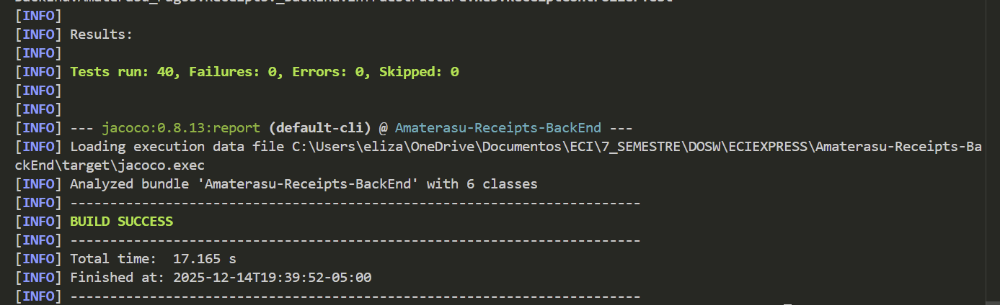

2. **Reporte JaCoCo con cobertura de código**

    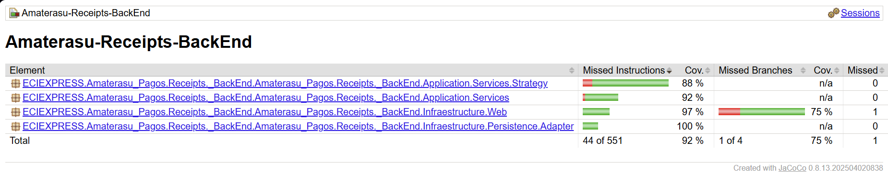

---

### ✅ Criterios de aceptación de pruebas

Para considerar el sistema correctamente probado, se debe cumplir:

- ✅ **Cobertura mínima del 80%** en servicios y lógica de negocio
- ✅ **Todas las pruebas en estado PASSED** (sin fallos)
- ✅ **Cero errores de compilación** en el código de pruebas
- ✅ **Pruebas de casos felices y casos de error** implementadas

---

### 🔄 Integración con CI/CD

Las pruebas se ejecutan automáticamente en cada **push** o **pull request** mediante GitHub Actions:

```yaml
  - name: Build + Test + Coverage
    run: mvn -B clean verify
```

Esto garantiza que ningún cambio roto llegue a producción.

---

## 10. 🗂️ Código de la implementación organizado en las respectivas carpetas

El microservicio de **Recibos de Amaterasu** sigue una **arquitectura hexagonal (puertos y adaptadores)** que separa las responsabilidades en capas bien definidas, promoviendo la escalabilidad, testabilidad y mantenibilidad del código.

---

### 📂 Estructura general del proyecto (Scaffolding)

```
Amaterasu-Receipts-BackEnd/
│
├── 📁 src/
│   ├── 📁 main/
│   │   ├── 📁 java/ECIEXPRESS/Amaterasu_Pagos/Receipts/_BackEnd/
│   │   │   ├── 📁 Application/                               # 🔵 CAPA DE APLICACIÓN
│   │   │   │   ├── 📁 Mappers/
│   │   │   │   ├── 📁 Ports/
│   │   │   │   └── 📁 Services/
│   │   │   │
│   │   │   ├── 📁 Config/                                    # ⚙️ Configuraciones
│   │   │   │
│   │   │   ├── 📁 Domain/                                    # 🟢 CAPA DE DOMINIO
│   │   │   │   ├── 📁 Model/
│   │   │   │   └── 📁 Port/
│   │   │   │
│   │   │   ├── 📁 Exception/                                 # ⚠️ Manejo de errores
│   │   │   │
│   │   │   ├── 📁 Infrastructure/                            # 🟠 CAPA DE INFRAESTRUCTURA
│   │   │   │   ├── 📁 Clients/
│   │   │   │   ├── 📁 Persistence/
│   │   │   │   └── 📁 Web/
│   │   │   │
│   │   │   └── 📁 Utils/                                     # 🛠️ Utilidades
│   │   │
│   │   └── 📁 resources/                                     # 📄 Archivos de configuración
│   │
│   └── 📁 test/                                              # 🧪 PRUEBAS
│
├── 📁 docs/                                                  # 📚 Documentación
│
├── 📄 Dockerfile
├── 📄 docker-compose.yml
├── 📄 pom.xml
└── 📄 README.md
```

---

> ℹ️ Todo el código fuente está documentado y comentado para facilitar su comprensión, mantenimiento y extensión por parte de cualquier desarrollador.

### 🏛️ Arquitectura Hexagonal Implementada

<div align="center">

| 🎨 **Capa** | 📋 **Responsabilidad** | 🔗 **Dependencias** |
|:-----------|:----------------------|:-------------------|
| **🟢 Domain** | Lógica de negocio pura, entidades (`Receipt`, `PaymentMethod`) y puertos (interfaces) | ❌ Ninguna (independiente) |
| **🔵 Application** | Casos de uso, servicios (`ReceiptService`) y validaciones | ✅ Solo `Domain` |
| **🟠 Infrastructure** | Controladores REST, adaptadores de persistencia (`MongoReceiptRepository`) y clientes externos | ✅ `Domain` + `Application` |

</div>

**Flujo de dependencias:** `Infrastructure → Application → Domain`

---

### 🎯 Principios de diseño aplicados

<div align="center">

| ✅ **Principio** | 📋 **Implementación** |
|:----------------|:---------------------|
| **Separación de responsabilidades** | Cada capa tiene un propósito único y bien definido |
| **Inversión de dependencias** | Las capas externas dependen de interfaces definidas en el dominio |
| **Independencia del framework** | La lógica de negocio no depende de Spring o MongoDB |
| **Patrón Factory** | Creación centralizada de objetos de dominio válidos |
| **Testabilidad** | Fácil crear pruebas unitarias mockeando puertos y adaptadores |
| **Mantenibilidad** | Cambios en una capa no afectan a las demás |

</div>  

---

## 11. 🚀 Ejecución del Proyecto

### 📋 Prerrequisitos
- **Java 17**
- **Maven 3.8+**
- **Docker** (Opcional)

### 🛠️ Opción 1: Ejecución Local (Maven)

```bash
# 1. Clonar repositorio
git clone https://github.com/ECIXPRESS/Amaterasu-Receipts-BackEnd.git

# 2. Ejecutar aplicación
mvn spring-boot:run
```
📍 **URL Local:** `http://localhost:8082`  
📚 **Documentación API:** `http://localhost:8082/swagger-ui.html`

### 🐳 Opción 2: Ejecución con Docker

```bash
# Levantar el contenedor
docker-compose up --build -d
```

### ⚙️ Configuración
El servicio se conecta por defecto a los otros microservicios en `localhost`. Para cambiar esto, ajusta `application.yml` o usa variables de entorno.

## 12. ☁️ CI/CD y Despliegue en Azure

El proyecto implementa un **pipeline automatizado** con **GitHub Actions** para garantizar la calidad del código y el despliegue continuo en **Azure Cloud**.

---

### 🔗 Enlaces de Despliegue

<div align="center">

| 🌍 Ambiente | 🔗 URL | 📝 Estado |
|:-----------|:-------|:---------|
| **🟢 Producción** | [amaterasu-receipts-prod-cehwf3d3fngebxdj.eastus2-01.azurewebsites.net/swagger-ui/index.html      ](amaterasu-receipts-prod-cehwf3d3fngebxdj.eastus2-01.azurewebsites.net/swagger-ui/index.html    ) |  |
| **🟠 Desarrollo** | [amaterasu-receipts-dev-fkdvhqfabqf9bvg9.eastus2-01.azurewebsites.net/swagger-ui/index.html   ](amaterasu-receipts-dev-fkdvhqfabqf9bvg9.eastus2-01.azurewebsites.net/swagger-ui/index.html    ) |  |

</div>

---

### 🔄 Pipeline de Automatización

El flujo de trabajo se divide en dos etapas principales:

1. **Integración Continua (CI)**: Se ejecuta en cada *Pull Request*.
   - Compilación del proyecto con Maven.
   - Ejecución de pruebas unitarias y de integración.
   - Análisis de calidad de código con **SonarQube**.
   - Generación de reportes de cobertura con **JaCoCo**.

2. **Despliegue Continuo (CD)**: Se ejecuta al hacer merge a ramas principales.
   - Construcción de la imagen Docker.
   - Publicación de la imagen en **Azure Container Registry (ACR)**.
   - Despliegue automático en **Azure App Service**.
     - `develop` ➔ Ambiente de Desarrollo.
     - `main` ➔ Ambiente de Producción.

---

### ☁️ Infraestructura

<div align="center">

| Componente | Servicio Azure | Propósito |
|:-----------|:---------------|:----------|
| **Compute** |  | Ejecución del contenedor Docker del microservicio. |
| **Storage** |  | Almacenamiento privado de imágenes Docker. |
| **Database** |  | Persistencia de datos transaccionales. |
| **Monitoring** |  | Logs, métricas y trazabilidad en tiempo real. |

</div>

---

### 📊 Evidencias de Despliegue

**Azure Web App - Aplicación en ejecución**

<div align="center">
  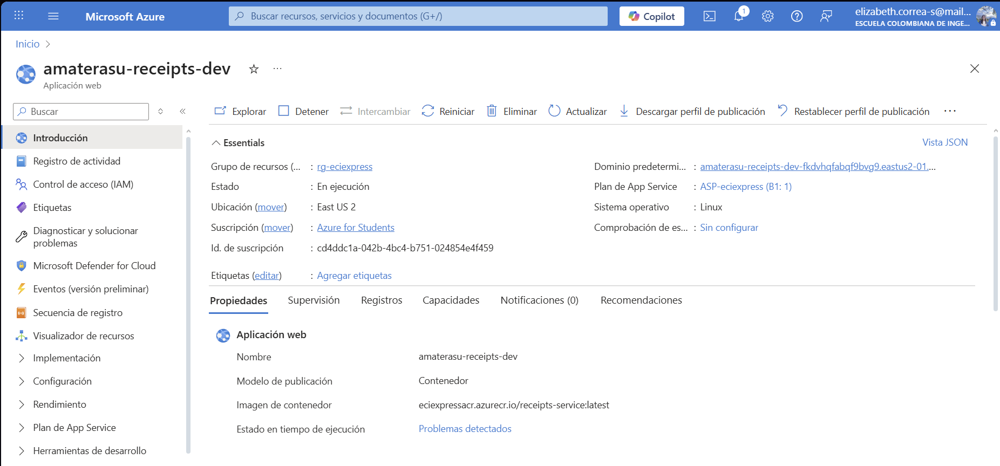
  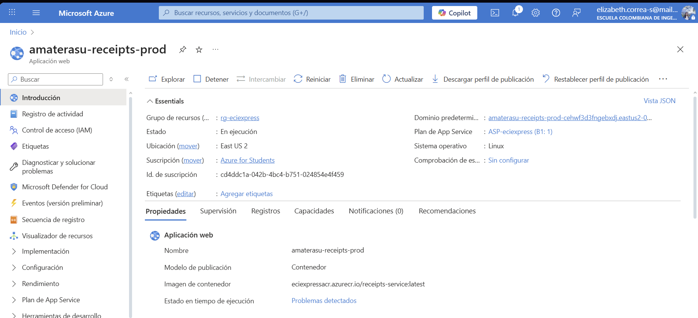
</div>

---

## 13. 🤝 Contribuciones y Metodología

El equipo **Amaterasu** aplicó la metodología **Scrum** con sprints semanales para garantizar una entrega incremental de valor y mejora continua.

### 👥 Equipo Scrum

| Rol | Responsabilidad |
|:---|:---|
| **Product Owner** | Priorización del Backlog y maximización de valor. |
| **Scrum Master** | Facilitador del proceso y eliminación de impedimentos. |
| **Developers** | Diseño, implementación y pruebas de funcionalidades. |

### 🔄 Eventos y Artefactos

- **Sprints Semanales**: Ciclos cortos de desarrollo.
- **Daily Scrum**: Sincronización diaria (15 min).
- **Sprint Review & Retrospective**: Demostración de incrementos y mejora de procesos.
- **Backlogs**: Gestión de tareas en Jira/GitHub Projects.

### 🎯 Valores del Equipo
Compromiso, Coraje, Enfoque, Apertura y Respeto fueron los pilares para afrontar desafíos técnicos como la integración con pasarelas de pago.

---

<div align="center">

### 🏆 Equipo **Amaterasu**


> 💡 **ECIEXPRESS** es un proyecto académico, pero su arquitectura y calidad están pensadas para ser escalables y adaptables a escenarios reales en instituciones educativas.

**🎓 Escuela Colombiana de Ingeniería Julio Garavito**

</div>

---


